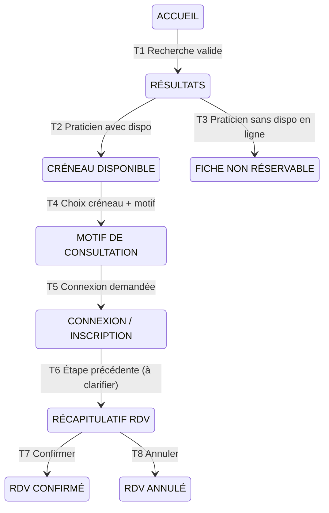

# Cas de test — Doctolib.fr

**Légende des statuts :** Passé · À clarifier · Non exécuté

## Tableau de traçabilité

| ID | Technique | Élément couvert | Statut | Défaut lié |
|---|---|---|---|---|
| DOC-CT-01 | Partitions d'équivalence | Spécialité valide | Passé | — |
| DOC-CT-02 | Partitions d'équivalence | Mot inexistant | Passé | — |
| DOC-CT-03 | Partitions d'équivalence | Caractères spéciaux | Passé | — |
| DOC-CT-04 | Partitions d'équivalence | Champ vide | Passé | — |
| DOC-CT-05 | Partitions d'équivalence | Texte très long | Passé | — |
| DOC-CT-06 | Valeurs limites | Code postal 5 chiffres | Passé | — |
| DOC-CT-07 | Valeurs limites | Code postal 6 chiffres | À clarifier | DOC-BUG-01 |
| DOC-CT-08 | Tables de décision | Règle 1 | Passé | — |
| DOC-CT-09 | Tables de décision | Règle 2 | À clarifier | DOC-BUG-02 |
| DOC-CT-10 | Tables de décision | Règle 3 | Passé | — |
| DOC-CT-11 | Tables de décision | Règle 4 | Passé | — |
| DOC-CT-12 | Transitions d'état | T1 | Passé | — |
| DOC-CT-13 | Transitions d'état | T2 | Non exécuté | — |
| DOC-CT-14 | Transitions d'état | T3 | Passé | — |
| DOC-CT-15 | Transitions d'état | T4 | Passé | — |
| DOC-CT-16 | Transitions d'état | T5 | Non exécuté | — |
| DOC-CT-17 | Transitions d'état | T6 | À clarifier | — |
| DOC-CT-18 | Transitions d'état | T7 | Passé | — |
| DOC-CT-19 | Transitions d'état | T8 | Passé | — |

---

## Partitions d'équivalence
**Champ testé : Spécialité / Nom / Établissement**

### DOC-CT-01 — Recherche par spécialité valide
**Précondition :** Être sur la page d'accueil Doctolib

**Étapes :**
1. Cliquer sur le champ "Spécialité / Nom / Établissement"
2. Saisir "Cardiologue"
3. Sélectionner "Cardiologue" dans la liste déroulante
4. Cliquer sur "Rechercher"

**Résultat attendu :** Une liste de cardiologues s'affiche
**Résultat obtenu :** Une liste de cardiologues s'affiche
**Statut :** Passé

---

### DOC-CT-02 — Recherche avec un mot inexistant
**Précondition :** Être sur la page d'accueil Doctolib

**Étapes :**
1. Cliquer sur le champ "Spécialité / Nom / Établissement"
2. Saisir "xyzabc"

**Résultat attendu :** Le message "Aucun résultat ne correspond à cette recherche" s'affiche automatiquement sans cliquer sur Rechercher
**Résultat obtenu :** Le message "Aucun résultat ne correspond à cette recherche" s'affiche automatiquement
**Statut :** Passé

---

### DOC-CT-03 — Recherche avec des caractères spéciaux
**Précondition :** Être sur la page d'accueil Doctolib

**Étapes :**
1. Cliquer sur le champ "Spécialité / Nom / Établissement"
2. Saisir "@%#&"

**Résultat attendu :** Le message "Aucun résultat ne correspond à cette recherche" s'affiche automatiquement sans cliquer sur Rechercher
**Résultat obtenu :** Le message "Aucun résultat ne correspond à cette recherche" s'affiche automatiquement dès la saisie de @
**Statut :** Passé

---

### DOC-CT-04 — Recherche avec le champ spécialité vide
**Précondition :** Être sur la page d'accueil Doctolib

**Étapes :**
1. Cliquer sur le bouton "Rechercher" sans avoir saisi de texte dans le champ Spécialité

**Résultat attendu :** Le message "Saisissez un mot clé pour lancer la recherche" s'affiche
**Résultat obtenu :** Le message "Saisissez un mot clé pour lancer la recherche" s'affiche
**Statut :** Passé

---

### DOC-CT-05 — Recherche avec un texte très long
**Précondition :** Être sur la page d'accueil Doctolib

**Étapes :**
1. Cliquer sur le champ "Spécialité / Nom / Établissement"
2. Saisir une longue chaîne de caractères : "aaaaaaaaaaaaaaaaaaaaaaaaaaaaaaaaa" (33 caractères)

**Résultat attendu :** Le message "Aucun résultat ne correspond à cette recherche" s'affiche. La saisie n'est pas limitée en nombre de caractères.
**Résultat obtenu :** Le message "Aucun résultat ne correspond à cette recherche" s'affiche. Aucune limite de caractères n'est imposée.
**Statut :** Passé

---

## Analyse des valeurs limites
**Champ testé : Lieu (code postal)**

*Hypothèse de départ : le champ Lieu n'acceptait que les codes postaux à 5 chiffres. Après test, j'ai constaté que ce n'est pas un champ code postal strict — il accepte des codes partiels, des codes complets et des noms de villes. L'analyse porte donc sur la borne haute de longueur, en analyse à 2 valeurs : 5 chiffres (dernière valeur valide) et 6 chiffres (première valeur invalide).*

### DOC-CT-06 — Saisie d'un code postal complet valide
**Précondition :** Être sur la page d'accueil Doctolib

**Étapes :**
1. Cliquer sur le champ "Lieu"
2. Saisir "69960"
3. Observer les suggestions affichées

**Résultat attendu :** La proposition "Autour de moi" apparaît suivie de la liste des communes du bon code postal : Corbas, France
**Résultat obtenu :** La proposition "Autour de moi" apparaît suivie de la liste des communes du bon code postal : Corbas, France
**Statut :** Passé

---

### DOC-CT-07 — Saisie d'un code postal trop long (6 chiffres)
**Précondition :** Être sur la page d'accueil Doctolib

**Étapes :**
1. Cliquer sur le champ "Lieu"
2. Saisir "699600" (6 chiffres)
3. Observer les suggestions affichées

**Résultat attendu :** Comportement à clarifier. Option A : message d'erreur "Code postal invalide". Option B : si le repli est voulu, l'indiquer clairement à l'utilisateur.
**Résultat obtenu :** Seule l'option "Autour de moi" s'affiche. Aucun message d'erreur — le système se replie silencieusement sur la géolocalisation.
**Statut :** À clarifier — voir [DOC-BUG-01](./03-rapports-defaut.md#doc-bug-01--repli-silencieux-sur-la-géolocalisation-lors-de-la-saisie-dun-code-postal-invalide)

*Note : Sans accès aux spécifications Doctolib, impossible de déterminer si ce comportement est voulu. Question à poser à l'équipe produit.*

---

## Tables de décision
**Fonctionnalité testée : filtres Disponibilité et Secteur combinés**
**Recherche de base : "Médecin généraliste" + code postal "69960"**

2 conditions booléennes = 4 combinaisons testées.

| | Règle 1 | Règle 2 | Règle 3 | Règle 4 |
|---|---|---|---|---|
| **Conditions** | | | | |
| Disponibilité activée | Oui | Oui | Non | Non |
| Secteur 1 activé | Oui | Non | Oui | Non |
| **Action attendue** | | | | |
| Médecins affichés | Disponibles aujourd'hui ET secteur 1 | Disponibles aujourd'hui, tous secteurs | Secteur 1 uniquement | Sans filtre |
| **Cas de test** | DOC-CT-08 | DOC-CT-09 | DOC-CT-10 | DOC-CT-11 |

### DOC-CT-08 — Filtres Disponibilité ET Secteur 1 activés simultanément
**Précondition :** Avoir effectué une recherche "Médecin généraliste" code postal "69960"

**Étapes :**
1. Cliquer sur "Disponibilité" et sélectionner "Aujourd'hui"
2. Cliquer sur "Secteur" et sélectionner "Secteur 1"
3. Cliquer sur "Afficher les résultats"

**Résultat attendu :** Les résultats affichés sont uniquement des médecins disponibles aujourd'hui ET conventionnés secteur 1
**Résultat obtenu :** 6 résultats affichés — tous disponibles aujourd'hui et conventionnés secteur 1 dans le CP 69960 et environs
**Statut :** Passé

---

### DOC-CT-09 — Filtre Disponibilité seul activé
**Précondition :** Avoir effectué une recherche "Médecin généraliste" code postal "69960"

**Étapes :**
1. Cliquer sur "Disponibilité" et sélectionner "Aujourd'hui"
2. Cliquer sur "Afficher les résultats"

**Résultat attendu :** Les résultats affichés sont uniquement des médecins disponibles aujourd'hui, tous secteurs confondus
**Résultat obtenu :** 62 résultats affichés — tous disponibles aujourd'hui, tous secteurs confondus. Certains médecins affichent leur secteur, d'autres non.
**Statut :** À clarifier

*Note : Des établissements non médicaux apparaissent dans les résultats (pharmacies, maisons de santé...). Voir [DOC-BUG-02](./03-rapports-defaut.md#doc-bug-02--des-établissements-non-médicaux-apparaissent-dans-une-recherche-médecin-généraliste).*

---

### DOC-CT-10 — Filtre Secteur 1 seul activé
**Précondition :** Avoir effectué une recherche "Médecin généraliste" code postal "69960"

**Étapes :**
1. Cliquer sur "Secteur" et sélectionner "Secteur 1"
2. Cliquer sur "Afficher les résultats"

**Résultat attendu :** Les résultats affichés sont uniquement des médecins conventionnés secteur 1
**Résultat obtenu :** 820 résultats affichés — tous conventionnés secteur 1 dans le CP 69960 et environs, pas forcément disponibles aujourd'hui
**Statut :** Passé

---

### DOC-CT-11 — Aucun filtre activé
**Précondition :** Être sur la page d'accueil Doctolib

**Étapes :**
1. Saisir "Médecin généraliste" dans le champ Spécialité
2. Saisir "69960" dans le champ Lieu
3. Cliquer sur "Rechercher"
4. Ne pas activer de filtre

**Résultat attendu :** Les résultats affichés sont tous les médecins généralistes du CP 69960 et environs, toutes disponibilités et conventions confondues
**Résultat obtenu :** 1146 résultats affichés — toutes disponibilités et conventions confondues
**Statut :** Passé

---

## Transitions d'état
**Fonctionnalité testée : parcours de prise de rendez-vous**
**Recherche de base : "Diététicien" + code postal "01160"**

### Diagramme des états

*Notes :*
- *T6 représente le comportement observé ; son caractère voulu reste à clarifier (voir DOC-CT-17).*
- *DOC-CT-18 passe par une connexion au compte avant de confirmer ; cet enchaînement n'est pas représenté dans le diagramme.*
- *Couverture des transitions valides : 6 transitions sur 8 exercées (75 %). DOC-CT-13 (T2) et DOC-CT-16 (T5) restent à exécuter.*

### DOC-CT-12 — T1 : recherche valide mène à la page des résultats
**Précondition :** Être sur la page d'accueil Doctolib

**Étapes :**
1. Cliquer sur le champ "Spécialité / Nom / Établissement" et saisir "Diététicien"
2. Cliquer sur le champ "Lieu" et saisir "01160"
3. Cliquer sur "Rechercher"

**Résultat attendu :** La page des résultats s'affiche avec une liste de diététiciens disponibles près du code postal 01160
**Résultat obtenu :** 25 résultats affichés
**Statut :** Passé

---

### DOC-CT-13 — T2 : accès à la page d'un praticien avec disponibilités
**Précondition :** Être sur la page des résultats suite à une recherche "Diététicien" code postal "01160"

**Étapes :**
1. Cliquer sur un praticien avec des créneaux disponibles

**Résultat attendu :** La page du praticien s'affiche avec ses créneaux disponibles
**Résultat obtenu :** —
**Statut :** Non exécuté

---

### DOC-CT-14 — T3 : accès à la fiche d'un praticien non réservable en ligne
**Précondition :** Être sur la page des résultats suite à une recherche "Diététicien" code postal "01160"

**Étapes :**
1. Cliquer sur un praticien sans créneau disponible visible

**Résultat attendu :** La fiche du praticien s'affiche. Le bouton "Prendre rendez-vous" est désactivé avec le message "Cet établissement n'est pas réservable en ligne sur Doctolib"
**Résultat obtenu :** La fiche du praticien s'affiche avec le bouton "Prendre rendez-vous" désactivé et le message indiqué
**Statut :** Passé

---

### DOC-CT-15 — T4 : choix d'un créneau mène à la page du motif de consultation
**Précondition :** Être sur la page d'un praticien avec des créneaux disponibles, suite à une recherche "Diététicien" code postal "01160"

**Étapes :**
1. Cliquer sur le créneau choisi

**Résultat attendu :** La page "Choisissez le motif de la consultation" s'affiche
**Résultat obtenu :** La page "Choisissez le motif de la consultation" s'affiche
**Statut :** Passé

---

### DOC-CT-16 — T5 : choix d'un motif mène à la page de connexion
**Précondition :** Être sur la page "Choisissez le motif de la consultation", sans être connecté

**Étapes :**
1. Sélectionner un motif de consultation

**Résultat attendu :** La page de connexion/inscription s'affiche
**Résultat obtenu :** —
**Statut :** Non exécuté

---

### DOC-CT-17 — T6 : bouton "Étape précédente" depuis la page de connexion
**Précondition :** Être sur la page de connexion/inscription, suite au choix d'un créneau et d'un motif de consultation

**Étapes :**
1. Cliquer sur le lien "Étape précédente"

**Résultat attendu :** Comportement à clarifier. Option A : retour à la page "Motif de consultation". Option B : arrivée sur la page récapitulatif "Confirmer ou annuler le RDV" si conçu ainsi dans les spécifications.
**Résultat obtenu :** Arrivée sur la page récapitulatif "Confirmer ou annuler le RDV"
**Statut :** À clarifier

*Note : Sans accès aux spécifications Doctolib, impossible de déterminer si ce comportement est voulu. Question à poser à l'équipe produit.*

---

### DOC-CT-18 — T7 : confirmer le RDV (après connexion)
**Précondition :** Être sur la page de connexion/inscription, suite au choix d'un créneau et d'un motif de consultation

**Étapes :**
1. Cliquer sur le bouton "Se connecter"
2. Saisir son adresse mail et cliquer sur "Continuer"
3. Saisir le mot de passe et cliquer sur "Continuer"
4. Confirmer l'identité de la personne qui prend le rendez-vous
5. Répondre "Non" à la question sur une première consultation avec ce soignant
6. Cliquer sur le bouton "Confirmer le RDV"

**Résultat attendu :** Page de confirmation affichée et email de confirmation reçu
**Résultat obtenu :** Page de confirmation affichée et email de confirmation reçu
**Statut :** Passé

---

### DOC-CT-19 — T8 : annuler le RDV depuis la page récapitulatif
**Précondition :** Être sur la page récapitulatif "Confirmer ou annuler le RDV"

**Étapes :**
1. Cliquer sur "Annuler ce RDV"

**Résultat attendu :** Le RDV est annulé et le créneau est libéré
**Résultat obtenu :** Retour à la page du créneau horaire. Le créneau est libéré et le RDV est annulé.
**Statut :** Passé